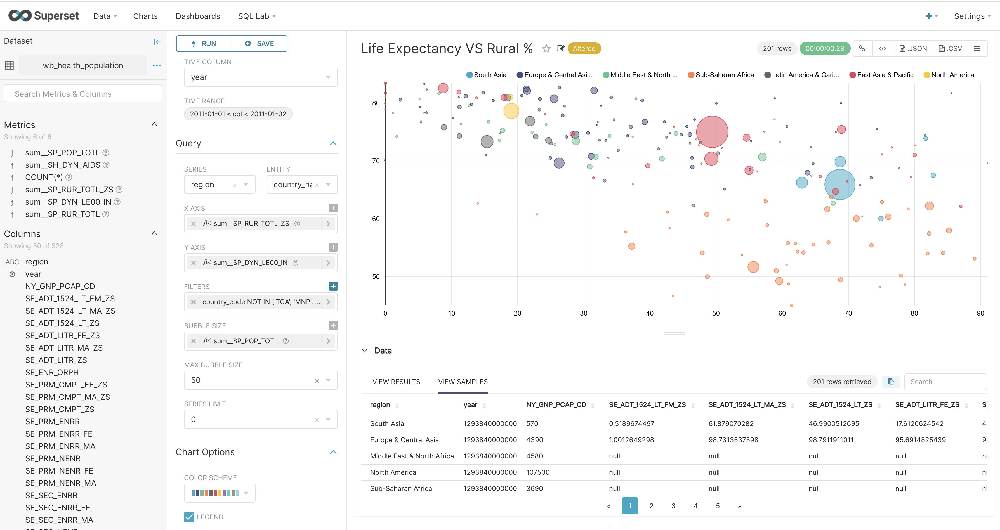

# apache-superset


## Getting started

To make it easy for you to get started with GitLab, here's a list of recommended next steps.

Already a pro? Just edit this README.md and make it your own. Want to make it easy? [Use the template at the bottom](#editing-this-readme)!

## Add your files

- [ ] [Create](https://docs.gitlab.com/ee/user/project/repository/web_editor.html#create-a-file) or [upload](https://docs.gitlab.com/ee/user/project/repository/web_editor.html#upload-a-file) files
- [ ] [Add files using the command line](https://docs.gitlab.com/ee/gitlab-basics/add-file.html#add-a-file-using-the-command-line) or push an existing Git repository with the following command:

```
cd existing_repo
git remote add origin https://gitlab.chimera.cyber.gc.ca/bigdig12team9/apache-superset.git
git branch -M main
git push -uf origin main
```

## Integrate with your tools

- [ ] [Set up project integrations](https://gitlab.chimera.cyber.gc.ca/bigdig12team9/apache-superset/-/settings/integrations)

## Collaborate with your team

- [ ] [Invite team members and collaborators](https://docs.gitlab.com/ee/user/project/members/)
- [ ] [Create a new merge request](https://docs.gitlab.com/ee/user/project/merge_requests/creating_merge_requests.html)
- [ ] [Automatically close issues from merge requests](https://docs.gitlab.com/ee/user/project/issues/managing_issues.html#closing-issues-automatically)
- [ ] [Enable merge request approvals](https://docs.gitlab.com/ee/user/project/merge_requests/approvals/)
- [ ] [Automatically merge when pipeline succeeds](https://docs.gitlab.com/ee/user/project/merge_requests/merge_when_pipeline_succeeds.html)

## Test and Deploy

Use the built-in continuous integration in GitLab.

- [ ] [Get started with GitLab CI/CD](https://docs.gitlab.com/ee/ci/quick_start/index.html)
- [ ] [Analyze your code for known vulnerabilities with Static Application Security Testing(SAST)](https://docs.gitlab.com/ee/user/application_security/sast/)
- [ ] [Deploy to Kubernetes, Amazon EC2, or Amazon ECS using Auto Deploy](https://docs.gitlab.com/ee/topics/autodevops/requirements.html)
- [ ] [Use pull-based deployments for improved Kubernetes management](https://docs.gitlab.com/ee/user/clusters/agent/)
- [ ] [Set up protected environments](https://docs.gitlab.com/ee/ci/environments/protected_environments.html)

***

# Editing this README

When you're ready to make this README your own, just edit this file and use the handy template below (or feel free to structure it however you want - this is just a starting point!). Thank you to [makeareadme.com](https://www.makeareadme.com/) for this template.

## Suggestions for a good README
Every project is different, so consider which of these sections apply to yours. The sections used in the template are suggestions for most open source projects. Also keep in mind that while a README can be too long and detailed, too long is better than too short. If you think your README is too long, consider utilizing another form of documentation rather than cutting out information.

## Name
Choose a self-explaining name for your project.

## Description
Let people know what your project can do specifically. Provide context and add a link to any reference visitors might be unfamiliar with. A list of Features or a Background subsection can also be added here. If there are alternatives to your project, this is a good place to list differentiating factors.

## Badges
On some READMEs, you may see small images that convey metadata, such as whether or not all the tests are passing for the project. You can use Shields to add some to your README. Many services also have instructions for adding a badge.

## Visuals
Depending on what you are making, it can be a good idea to include screenshots or even a video (you'll frequently see GIFs rather than actual videos). Tools like ttygif can help, but check out Asciinema for a more sophisticated method.

## Installation
Within a particular ecosystem, there may be a common way of installing things, such as using Yarn, NuGet, or Homebrew. However, consider the possibility that whoever is reading your README is a novice and would like more guidance. Listing specific steps helps remove ambiguity and gets people to using your project as quickly as possible. If it only runs in a specific context like a particular programming language version or operating system or has dependencies that have to be installed manually, also add a Requirements subsection.

## Usage
Use examples liberally, and show the expected output if you can. It's helpful to have inline the smallest example of usage that you can demonstrate, while providing links to more sophisticated examples if they are too long to reasonably include in the README.

## Support
Tell people where they can go to for help. It can be any combination of an issue tracker, a chat room, an email address, etc.

## Roadmap
If you have ideas for releases in the future, it is a good idea to list them in the README.

## Contributing
State if you are open to contributions and what your requirements are for accepting them.

For people who want to make changes to your project, it's helpful to have some documentation on how to get started. Perhaps there is a script that they should run or some environment variables that they need to set. Make these steps explicit. These instructions could also be useful to your future self.

You can also document commands to lint the code or run tests. These steps help to ensure high code quality and reduce the likelihood that the changes inadvertently break something. Having instructions for running tests is especially helpful if it requires external setup, such as starting a Selenium server for testing in a browser.

## Authors and acknowledgment
Show your appreciation to those who have contributed to the project.

## License
For open source projects, say how it is licensed.

## Project status
If you have run out of energy or time for your project, put a note at the top of the README saying that development has slowed down or stopped completely. Someone may choose to fork your project or volunteer to step in as a maintainer or owner, allowing your project to keep going. You can also make an explicit request for maintainers.
=======
<!--
Licensed to the Apache Software Foundation (ASF) under one
or more contributor license agreements.  See the NOTICE file
distributed with this work for additional information
regarding copyright ownership.  The ASF licenses this file
to you under the Apache License, Version 2.0 (the
"License"); you may not use this file except in compliance
with the License.  You may obtain a copy of the License at

  http://www.apache.org/licenses/LICENSE-2.0

Unless required by applicable law or agreed to in writing,
software distributed under the License is distributed on an
"AS IS" BASIS, WITHOUT WARRANTIES OR CONDITIONS OF ANY
KIND, either express or implied.  See the License for the
specific language governing permissions and limitations
under the License.
-->

# Superset

[](https://opensource.org/licenses/Apache-2.0)
[](https://github.com/apache/superset/tree/latest)
[](https://github.com/apache/superset/actions)
[](https://badge.fury.io/py/apache-superset)
[](https://codecov.io/github/apache/superset)
[](https://pypi.python.org/pypi/apache-superset)
[](https://join.slack.com/t/apache-superset/shared_invite/zt-16jvzmoi8-sI7jKWp~xc2zYRe~NqiY9Q)
[](https://superset.apache.org)


A modern, enterprise-ready business intelligence web application.

[**Why Superset?**](#why-superset) |
[**Supported Databases**](#supported-databases) |
[**Installation and Configuration**](#installation-and-configuration) |
[**Release Notes**](RELEASING/README.md#release-notes-for-recent-releases) |
[**Get Involved**](#get-involved) |
[**Contributor Guide**](#contributor-guide) |
[**Resources**](#resources) |
[**Organizations Using Superset**](RESOURCES/INTHEWILD.md)

## Why Superset?

Superset is a modern data exploration and data visualization platform. Superset can replace or augment proprietary business intelligence tools for many teams. Superset integrates well with a variety of data sources.

Superset provides:

- A **no-code interface** for building charts quickly
- A powerful, web-based **SQL Editor** for advanced querying
- A **lightweight semantic layer** for quickly defining custom dimensions and metrics
- Out of the box support for **nearly any SQL** database or data engine
- A wide array of **beautiful visualizations** to showcase your data, ranging from simple bar charts to geospatial visualizations
- Lightweight, configurable **caching layer** to help ease database load
- Highly extensible **security roles and authentication** options
- An **API** for programmatic customization
- A **cloud-native architecture** designed from the ground up for scale

## Screenshots & Gifs

**Large Gallery of Visualizations**

<kbd></kbd><br/>

**Craft Beautiful, Dynamic Dashboards**

<kbd></kbd><br/>

**No-Code Chart Builder**

<kbd></kbd><br/>

**Powerful SQL Editor**

<kbd></kbd><br/>

## Supported Databases

Superset can query data from any SQL-speaking datastore or data engine (Presto, Trino, Athena, [and more](https://superset.apache.org/docs/databases/installing-database-drivers/)) that has a Python DB-API driver and a SQLAlchemy dialect.

Here are some of the major database solutions that are supported:

<p align="center">
  
  
  
  
  
  
  
    
  
  
  
  
  
  
  
  
  
  
  
  
  
  
  
  
  
  
  
  
  
</p>

**A more comprehensive list of supported databases** along with the configuration instructions can be found
[here](https://superset.apache.org/docs/databases/installing-database-drivers).

Want to add support for your datastore or data engine? Read more [here](https://superset.apache.org/docs/frequently-asked-questions#does-superset-work-with-insert-database-engine-here) about the technical requirements.

## Installation and Configuration

[Extended documentation for Superset](https://superset.apache.org/docs/installation/installing-superset-using-docker-compose)

## Get Involved

- Ask and answer questions on [StackOverflow](https://stackoverflow.com/questions/tagged/apache-superset) using the **apache-superset** tag
- [Join our community's Slack](https://join.slack.com/t/apache-superset/shared_invite/zt-16jvzmoi8-sI7jKWp~xc2zYRe~NqiY9Q)
  and please read our [Slack Community Guidelines](https://github.com/apache/superset/blob/master/CODE_OF_CONDUCT.md#slack-community-guidelines)
- [Join our dev@superset.apache.org Mailing list](https://lists.apache.org/list.html?dev@superset.apache.org)

## Contributor Guide

Interested in contributing? Check out our
[CONTRIBUTING.md](https://github.com/apache/superset/blob/master/CONTRIBUTING.md)
to find resources around contributing along with a detailed guide on
how to set up a development environment.

## Resources

- Getting Started with Superset
  - [Superset in 2 Minutes using Docker Compose](https://superset.apache.org/docs/installation/installing-superset-using-docker-compose#installing-superset-locally-using-docker-compose)
  - [Installing Database Drivers](https://superset.apache.org/docs/databases/docker-add-drivers/)
  - [Building New Database Connectors](https://preset.io/blog/building-database-connector/)
  - [Create Your First Dashboard](https://superset.apache.org/docs/creating-charts-dashboards/first-dashboard)
  - [Comprehensive Tutorial for Contributing Code to Apache Superset
](https://preset.io/blog/tutorial-contributing-code-to-apache-superset/)
- [Documentation for Superset End-Users (by Preset)](https://docs.preset.io/docs/terminology)
- Deploying Superset
  - [Official Docker image](https://hub.docker.com/r/apache/superset)
  - [Helm Chart](https://github.com/apache/superset/tree/master/helm/superset)
- Recordings of Past [Superset Community Events](https://preset.io/events)
  - [Live Demo: Interactive Time-series Analysis with Druid and Superset](https://preset.io/events/2021-03-02-interactive-time-series-analysis-with-druid-and-superset/)
  - [Live Demo: Visualizing MongoDB and Pinot Data using Trino](https://preset.io/events/2021-04-13-visualizing-mongodb-and-pinot-data-using-trino/)
	- [Superset Contributor Bootcamp](https://preset.io/events/superset-contributor-bootcamp-dec-21/)
	- [Introduction to the Superset API](https://preset.io/events/introduction-to-the-superset-api/)
	- [Apache Superset 1.3 Meetup](https://preset.io/events/apache-superset-1-3/)
	- [Building a Database Connector for Superset](https://preset.io/events/2021-02-16-building-a-database-connector-for-superset/)
- Visualizations
  - [Building Custom Viz Plugins](https://superset.apache.org/docs/installation/building-custom-viz-plugins)
  - [Managing and Deploying Custom Viz Plugins](https://medium.com/nmc-techblog/apache-superset-manage-custom-viz-plugins-in-production-9fde1a708e55)
  - [Why Apache Superset is Betting on Apache ECharts](https://preset.io/blog/2021-4-1-why-echarts/)

- [Superset API](https://superset.apache.org/docs/rest-api)
